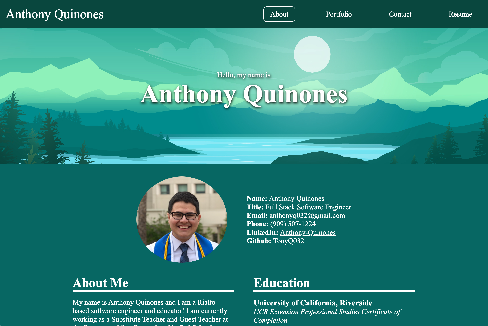
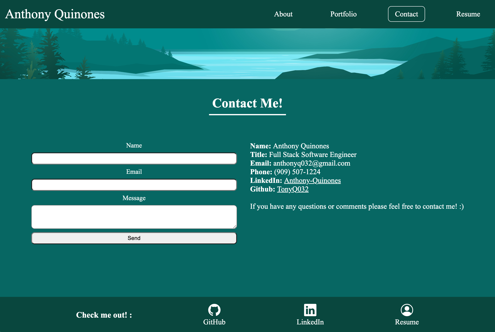
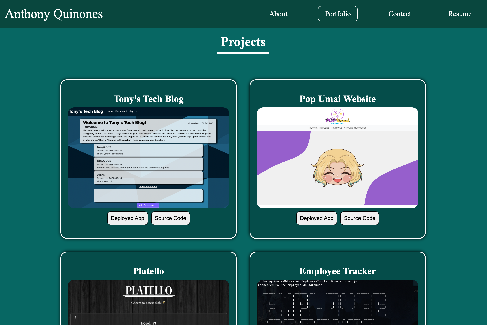

# simple-react-portfolio

A simple portfolio I created using React!

## Description

The purpose of this project was to build and deploy a functional portfolio website utilizing React and Github Pages. The entirety of the portfolio is one single page with various React components that conditionally load depending on which "page" the user has selected.

The website can be viewed by clicking [here.](https://tonyq032.github.io/react-portfolio/#)

## Technologies

Below is a list of all the technologies we utilized in order to build this project.

- [React](https://reactjs.org/)
- [Bootstrap Icons](https://icons.getbootstrap.com/)
- [EmailJS](https://www.emailjs.com/)
- [Sweet Alert 2](https://sweetalert2.github.io/)

## Screenshots

Below are various screenshots of the portfolio site.

### "About" Page:

### "Contact" Page:

### "Portfolio" Page:

## Questions

If you have any questions or comments, please feel free to contact me below:

### Anthony Quinones

Github: [TonyQ032](https://github.com/TonyQ032)

LinkedIn: [Anthony Quinones](https://www.linkedin.com/in/anthony-quinones/)

Email: anthonyq032@gmail.com
